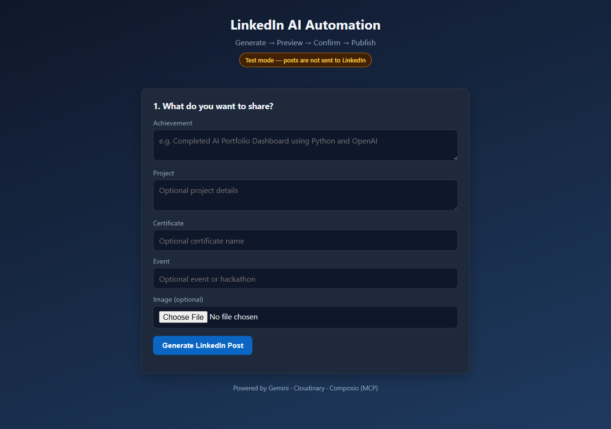
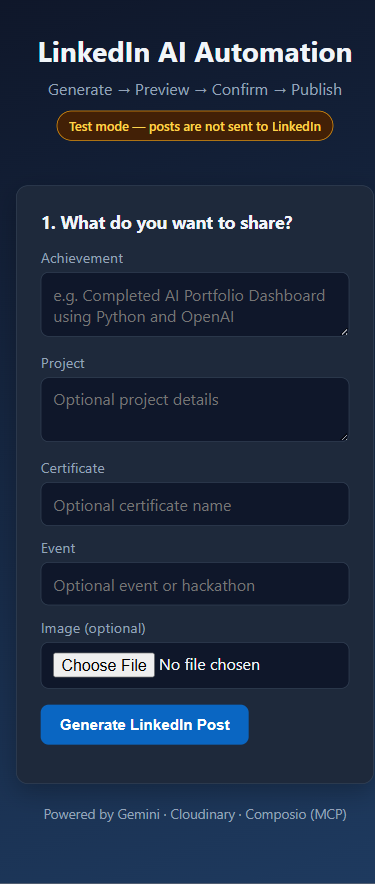

# AI LinkedIn Post Generator

[](https://github.com/kundurukarthiksai-creator/AI-LinkedIn-Post-Generator/actions/workflows/ci.yml)

Preview-first LinkedIn post automation built with Node.js, Express, Gemini/OpenAI, Cloudinary, and Composio LinkedIn tooling.

## What It Does

This app turns project updates, achievements, certificates, and events into polished LinkedIn post drafts. It supports optional image upload, shows a preview, and blocks publishing unless the user explicitly confirms the final draft.

The important design choice is safety: generation and publishing are separate steps.

## Screenshots

Captured locally in mock publish mode, where posts are not sent to LinkedIn.





## Features

- Generates LinkedIn-ready post copy and hashtags with Gemini or OpenAI.
- Uploads optional images through Cloudinary.
- Creates a preview draft before publishing.
- Requires `confirmed: true` before any LinkedIn publish attempt.
- Supports mock publish mode for local testing.
- Separates routes, controllers, services, upload middleware, and environment config.

## Safety And Limits

- Publishing is intentionally gated. The app can generate and preview drafts without posting.
- Real LinkedIn publishing requires valid Composio/LinkedIn configuration and an explicit `confirmed: true` request.
- Local smoke tests use mock publish mode and do not send posts to LinkedIn.
- Drafts are stored in memory, so they reset when the server restarts.
- The current app does not include multi-user authentication, scheduling, or analytics.
- Treat generated copy as a draft that should be reviewed before publishing.

## Architecture

```text
Browser UI
  -> Express routes
  -> Post controller
  -> AI generation service
  -> Optional Cloudinary upload
  -> In-memory draft store
  -> Explicit confirmation
  -> Composio LinkedIn publish service
```

## Tech Stack

- Node.js
- Express
- Gemini / OpenAI
- Cloudinary
- Composio LinkedIn toolkit
- Multer
- Vanilla HTML/CSS/JavaScript

## Local Setup

```bash
npm install
copy .env.example .env
npm start
```

Then open:

```text
http://localhost:3000
```

For a quick server health check without real LinkedIn publishing:

```bash
npm run smoke
```

## Environment Variables

Use `.env.example` as the source of truth.

Required for AI generation:

- `AI_PROVIDER`
- `GEMINI_API_KEY` or `OPENAI_API_KEY`

Required for image upload:

- `CLOUDINARY_CLOUD_NAME`
- `CLOUDINARY_API_KEY`
- `CLOUDINARY_API_SECRET`

Required for real LinkedIn publishing:

- `COMPOSIO_API_KEY`
- `COMPOSIO_USER_ID`
- `LINKEDIN_AUTHOR_URN` if automatic author discovery is unavailable

For local testing without publishing:

```env
MOCK_LINKEDIN_PUBLISH=true
```

## API

Base URL:

```text
http://localhost:3000/api
```

Endpoints:

- `GET /health`
- `GET /linkedin/status`
- `POST /generate-post`
- `POST /upload-image`
- `POST /preview-post`
- `POST /publish-post`

Publishing is blocked unless:

```json
{
  "confirmed": true
}
```

## Verification Status

Verified locally:

- JavaScript syntax check passed.
- `npm ci --ignore-scripts --no-audit --no-fund` passed after lockfile repair.
- Mock-mode server health check passed at `/api/health`.
- Smoke-test command added and verified: `npm run smoke`.
- GitHub Actions CI runs `npm ci` and `npm run smoke` on pushes and pull requests.

## Planned Improvements

- Persist drafts in Redis or a database.
- Add user authentication for multi-user use.
- Add scheduled posts.
- Add post analytics.

## Resume Angle

Built a preview-first LinkedIn automation service with Node.js, Express, Gemini/OpenAI, Cloudinary, and Composio tooling, blocking publication until explicit user confirmation and separating generation, preview, and publish workflows.
